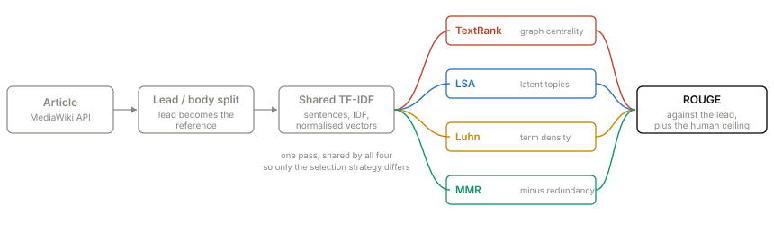
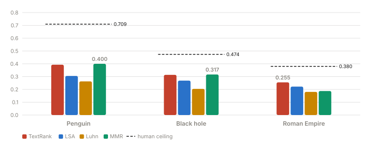
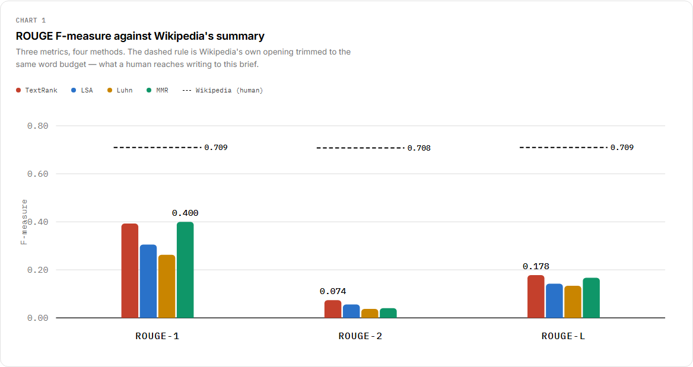
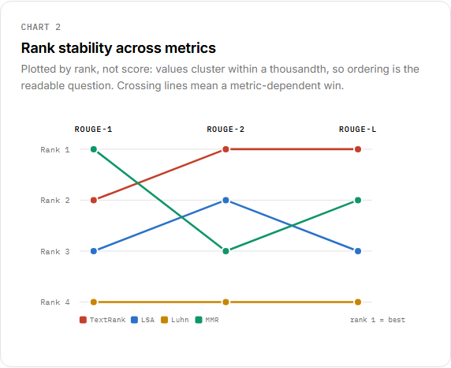
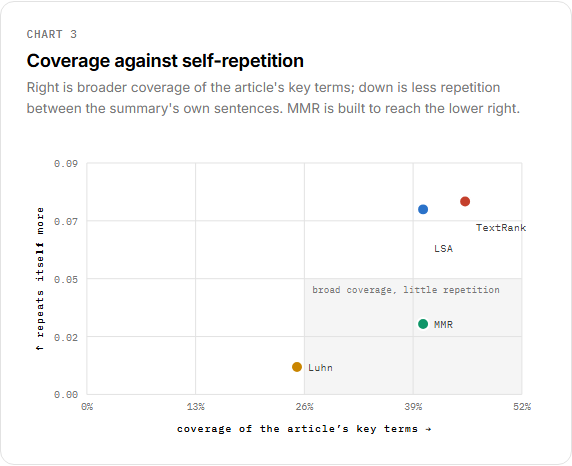
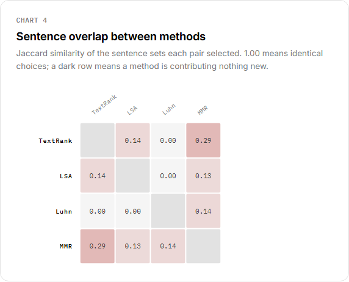
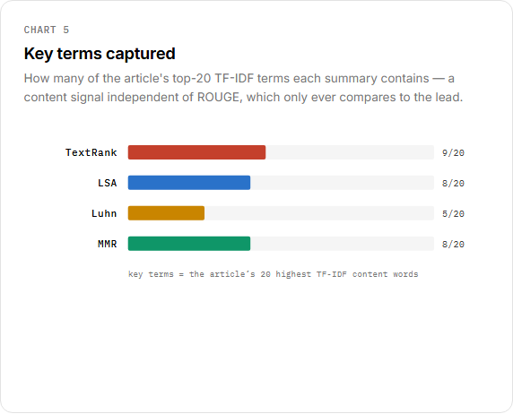
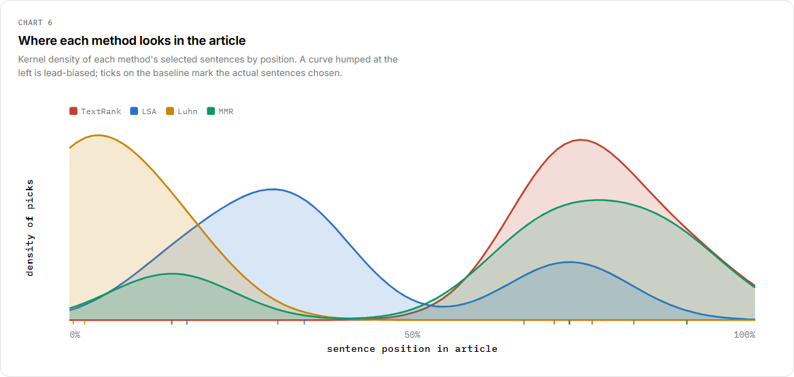

# Wikipedia Summarizer

Four summarization algorithms. One article. Scored against the people who wrote it.

[](https://akshayaa-403.github.io/Wikipedia-Summarizer/)
[](https://github.com/akshayaa-403/Wikipedia-Summarizer/actions/workflows/tests.yml)
[](LICENSE)

## Overview

Type any Wikipedia article. Four classical summarizers run in your browser, and each one's output is scored with ROUGE against the article's **lead section** — the summary Wikipedia's own editors wrote. You're not just comparing algorithms to each other; you're comparing them to humans.

Nothing is precomputed. Type `Kākāpō` and everything — summaries, scores, six charts — is calculated fresh in about 60 ms for a 4,300-word article.

**[→ Try it for any article](https://akshayaa-403.github.io/Wikipedia-Summarizer/)**

## How it works



One preprocessing pass feeds all four algorithms, so the only thing that varies is the selection strategy. When TextRank beats LSA it isn't because one got better tokenization.

## The four algorithms

I picked these because they fail in completely different ways:

| Algorithm             | What it does                                                        | Family          |
| --------------------- | ------------------------------------------------------------------- | --------------- |
| **TextRank**    | Runs PageRank on a graph of sentence similarities                   | Graph-based     |
| **LSA**         | Finds latent topics via SVD, picks one sentence per topic           | Topic modeling  |
| **Luhn** (1958) | Finds the densest window of frequent terms                          | Frequency-based |
| **MMR**         | Balances relevance against redundancy with what it's already picked | Diversity-aware |

MMR is the odd one out, and it shows: it's the only algorithm that looks backward at what it already selected. The first three score each sentence independently, so all three can return four sentences that say the same thing. MMR subtracts a redundancy penalty at every step — which is why it wins two of the three articles below.

## How well do they work?

ROUGE-1 F-measure against the article's lead. But there's a catch: scoring against the full lead would return 1.000 for a straight copy, so I trim the lead to the **same word budget** the algorithms get. That gives a **human ceiling** — what a person achieves writing to the same brief.



| Article      | Human ceiling | TextRank        | LSA   | Luhn  | MMR             |
| ------------ | ------------- | --------------- | ----- | ----- | --------------- |
| Penguin      | 0.709         | 0.393           | 0.305 | 0.263 | **0.400** |
| Black hole   | 0.474         | 0.314           | 0.269 | 0.204 | **0.317** |
| Roman Empire | 0.380         | **0.255** | 0.222 | 0.181 | 0.188           |

**No single algorithm wins.** MMR takes two, TextRank takes one — and MMR goes from best to worst between Penguin and Roman Empire. That instability is the point; it's why you need the full picture rather than one headline number.

The best algorithm reaches 56–67% of the human ceiling. That's the gap between "competent extractive summarization" and actually writing a summary.

## The six charts

Every search recomputes all six. Each answers something ROUGE alone can't.

|                                                                                                                                                                                          |                                                                                                                                                                                         |
| :--------------------------------------------------------------------------------------------------------------------------------------------------------------------------------------- | :-------------------------------------------------------------------------------------------------------------------------------------------------------------------------------------- |
| **ROUGE F-measure** — three metrics with the human ceiling as a dashed rule. The headline numbers.                                 | **Rank stability** — plotted by rank, not score. Values cluster within a thousandth, so ordering is the readable question.          |
| **Coverage vs self-repetition** — the chart that justifies MMR's existence. It should sit alone in the lower right. | **Sentence overlap** — Jaccard between every pair. A dark off-diagonal cell means two methods are agreeing.                    |
| **Key terms captured** — how many of the article's top-20 TF-IDF terms each summary contains. Independent of ROUGE.             | **Positional density** — where each method looks. A curve humped at the left is lead-biased. The most diagnostic chart here. |

## Quick start

No build step, no bundler, no runtime dependencies.

```bash
git clone https://github.com/akshayaa-403/Wikipedia-Summarizer
cd Wikipedia-Summarizer
python3 -m http.server 8765 --directory docs
```

Then open [http://127.0.0.1:8765](http://127.0.0.1:8765).

## Running the tests

The suite drives the real page in Chromium, so it needs the site being served:

```bash
npm install
npx playwright install chromium

python3 -m http.server 8765 --directory docs &   # in another shell
npm test
```

33 checks: the four summaries render and stay distinct, ROUGE recomputes for a new article, every chart draws, labels don't collide, both themes hold, and summaries open with a self-contained sentence. It fetches from the live Wikipedia API, so it exercises the same path a visitor does.

## Project structure

```
docs/
├── index.html
├── css/style.css
├── images/              # screenshots and the charts above
└── js/
    ├── wiki.js          # MediaWiki client, lead/body split, ROUGE
    ├── summarizers.js   # Four algorithms + shared TF-IDF preprocessing
    ├── charts.js        # Hand-rolled SVG (no charting library)
    └── app.js           # Page controller
tests/e2e/
└── browser_check.mjs    # Playwright suite
```

## Design decisions

- **Why extractive only?** Abstractive models need a 1.6 GB checkpoint and a server; this page is static files. That constraint is also a feature — it's why the charts are live for *any* article instead of precomputed for a fixed set.
- **ROUGE measures overlap, not correctness.** A summary that reuses the reference's vocabulary scores well even if it's wrong. That's why the page also reports key-term coverage, self-repetition and positional spread.
- **The colours are validated, not chosen.** Both palettes pass a colourblind-separation check against the exact surfaces they render on.

## License

MIT. Article text comes from Wikipedia and is [CC BY-SA 4.0](https://creativecommons.org/licenses/by-sa/4.0/).
