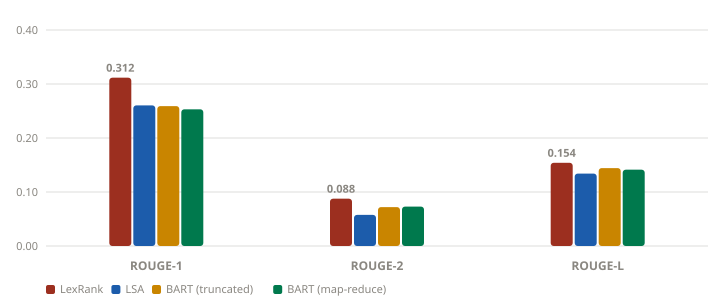

# Wikipedia Summarizer

Two summarizers of the same article, held to the same word budget, scored with
ROUGE against the summary Wikipedia's own editors wrote.

**→ [Live site](https://akshayaa-403.github.io/Wikipedia-Summarizer/)**

The repo is two independent halves, and it is worth knowing which one you are
looking at:

| | What it is | Where | Runs |
|---|---|---|---|
| **Site** | Four extractive methods — TextRank, LSA, Luhn, MMR — plus a human ceiling | `docs/` | live in your browser, any article you type |
| **Package** | BART truncation vs. hierarchical map-reduce | `src/wikisum/` | locally, CPU, 1.6 GB model |

They share a construction, not a code path: both split an article into its
**lead** and its **body**, summarize the body, and score the result against the
lead. Nothing is shared at runtime — the site has no backend and reads no
generated data file.

---

## The reference

The lead section (everything before the first `==` heading) is written by humans
to summarize the rest of the article. That makes it a free reference summary for
any article, with no manual labelling — the same construction behind
WikiSum-style datasets.

Reported: **ROUGE-1** (unigram overlap), **ROUGE-2** (bigram overlap — the
strictest, being sensitive to word order) and **ROUGE-L** (longest common
subsequence), all as F-measure.

**Every method is held to the same ~150-word budget.** This is not cosmetic.
ROUGE F-measure is computed against a reference several times longer than any
summary here, so recall — and with it F — rises with length almost regardless of
quality. An early run left methods at their natural lengths: LSA emitted 205
words, LexRank 76, and LSA "won" ROUGE-1 by 60%. That gap was measuring
verbosity. Fixing the budget is what makes the ROUGE column a comparison of
methods rather than of lengths.

---

## Half one: the site

Four extractive methods, chosen to fail differently, all running in the browser
over whatever article you name:

| Method | Family | What it ranks by |
|---|---|---|
| TextRank | graph | PageRank over a sentence-similarity graph — what the article keeps returning to |
| LSA | topic model | SVD over the term–sentence matrix; the top sentence per latent topic |
| Luhn (1958) | frequency | The densest window of high-frequency terms |
| MMR | diversity | Relevance *minus* similarity to what it already picked |

The first three score every sentence independently, so each can happily return
five sentences that say the same thing. MMR is the only one that penalises that,
and `Chart 3` on the site exists to show whether it succeeds.

**Results are per-article, not a fixed table.** Six charts and a table recompute
from scratch on every submission: ROUGE by method, rank stability across the
three metrics, coverage against self-repetition, pairwise sentence overlap,
key-term capture, and where in the article each method looked.

The row that makes those numbers readable is the **human ceiling** — Wikipedia's
own lead trimmed to the same 150-word budget. Scoring the untrimmed lead against
itself returns 1.000 every time and says nothing; trimmed, it is a real upper
bound. It moves per article (0.709 ROUGE-1 on *Penguin*, 0.380 on *Roman
Empire*), which is why every method also reports its score as a percentage of
the ceiling rather than in the abstract.

There is no backend and nothing to keep awake: Wikipedia's API is CORS-enabled,
and the ROUGE implementation is a few hundred lines of array maths. Its stemmer
is a light approximation of Porter, so live figures are indicative — for
bit-comparable numbers use the package.

## Half two: the package

`facebook/bart-large-cnn` accepts **1024 tokens**. The 25 benchmark articles
average **~9,960 words** of body text (up to 16,600). The standard approach —

```python
inputs = tokenizer(article, truncation=True, max_length=1024)
```

— never fails and never warns. It discards everything past the cut and returns a
fluent summary of the article's opening. For *Photosynthesis* that is about
**10% of the body**: the light reactions make it in, the Calvin cycle and the
C4/CAM pathways do not.

**The fix is hierarchical map-reduce summarization:**

1. **Chunk** the body into ~900-token windows that break on **sentence
   boundaries** — a chunk cut mid-clause leaves an abstractive model to invent an
   ending, which is how hallucinated facts get in.
2. **Overlap** consecutive chunks by one sentence, so a fact introduced at the
   end of chunk *n* and referenced by a pronoun at the start of chunk *n+1* still
   has its antecedent.
3. **Map** — summarize every chunk independently. Nothing is discarded.
4. **Reduce** — concatenate the chunk summaries, re-chunk, summarize again, until
   the intermediate text fits one window. The final pass sees material drawn from
   the whole article.

Implementation: [`chunking.py`](src/wikisum/chunking.py) and
[`summarize_bart_mapreduce`](src/wikisum/summarizers.py).

### Results



25 articles, scored against each article's lead, ~150-word budget per method.
The chart is regenerated by the benchmark from the same payload as the table, so
the two cannot drift.

| Method | ROUGE-1 | ROUGE-2 | ROUGE-L | Body read | Avg time | Wins |
|---|---|---|---|---|---|---|
| **LexRank** | **0.312** | **0.088** | **0.154** | 100% | 1.8 s | **21 / 25** |
| LSA | 0.260 | 0.058 | 0.134 | 100% | 0.9 s | 1 / 25 |
| BART (truncated) | 0.259 | 0.072 | 0.144 | 8.1% | 17 s | 3 / 25 |
| BART (map-reduce) | 0.253 | 0.073 | 0.141 | 100% | 125 s | 0 / 25 |

**Map-reduce does not beat truncation on ROUGE.** It reads 100% of the body
against the baseline's 8.1%, costs 7× the wall-clock time, and lands level — 2.3%
behind on ROUGE-1, 2.0% behind on ROUGE-L, 1.4% ahead on ROUGE-2, ahead on 11 of
25 articles. Reading twelve times more text bought no measured gain on this
metric. That held when the benchmark grew from 10 articles to 25, so it is not
small-sample noise.

Three things explain it, and they are worth more than a win would have been:

1. **The reference favours the baseline.** A lead introduces the subject, so it
   is topically closest to the article's *opening* — precisely the region
   truncation reads. A summary that faithfully covers late sections is penalised
   for spending words on material the lead never mentions.
2. **ROUGE rewards copying.** Extractive methods reuse Wikipedia's own sentences
   and therefore its vocabulary; abstractive models paraphrase and are marked
   down for it. That is most of why LexRank tops every column. ROUGE measures
   lexical overlap, not correctness — it cannot tell whether a summary is true.
3. **What map-reduce buys is coverage**, not ROUGE: the guarantee that no section
   was silently dropped. Whether that is worth 7× the compute depends on the
   task. The benchmark sizes the trade-off; it does not make the choice.

The honest one-line version: *the long-context fix works as engineering —
nothing is discarded — and this evaluation does not show it improving summary
quality as ROUGE-against-the-lead measures it.*

---

## Project layout

```
src/wikisum/            the Python package — installable, CLI, BART
  fetch.py              MediaWiki client; lead/body split, boilerplate removal
  chunking.py           sentence-boundary packing with overlap  ← the long-context fix
  summarizers.py        LexRank, LSA, BART truncated, BART map-reduce
  evaluate.py           ROUGE scoring and aggregation
  benchmark.py          runs everything; writes results.json + rouge-chart.svg
  cli.py                `wikisum` / `python -m wikisum`

docs/                   the GitHub Pages site — static, self-contained, no build
  index.html            page shell; every figure is filled in by JS
  css/style.css         all styling, incl. both themes
  js/wiki.js            Wikipedia fetch, lead/body split, sentence split, ROUGE
  js/summarizers.js     TextRank, LSA, Luhn, MMR + the shared TF-IDF preprocessing
  js/charts.js          hand-rolled SVG charts (no charting dependency)
  js/app.js             page controller: fetch → summarize → render
  data/                 benchmark output. Evidence for the table above;
                        the site does NOT read it.

tests/                  test_chunking.py, test_evaluate.py — pytest
tests/e2e/              browser_check.mjs — drives the real page in Chromium
```

Two things worth stating because the directory names imply otherwise:

- `docs/data/` is **not** a runtime input. Nothing in `docs/js/` fetches it. It
  exists so the table and chart in this README have a regenerable source.
- `docs/js/wiki.js` and `src/wikisum/fetch.py` implement the same lead/body
  split twice, once per language. They are kept in step by hand; the browser
  half is not generated from the Python half.

## Install

```bash
git clone https://github.com/akshayaa-403/Wikipedia-Summarizer
cd Wikipedia-Summarizer
pip install -e .          # deps + the `wikisum` command
python -c "import nltk; nltk.download('punkt'); nltk.download('punkt_tab')"
```

BART is downloaded from Hugging Face on first use (~1.6 GB) and runs on CPU.
The site needs none of this — open `docs/index.html` over any static server.

## Usage

```bash
# every method, scored against the article's lead section
python -m wikisum "Photosynthesis" --evaluate

# one method only
python -m wikisum "Roman Empire" --method bart_mapreduce
```

```
Photosynthesis
https://en.wikipedia.org/wiki/Photosynthesis
7,217 words | 32 sections | body splits into 12 chunks |
a single 1024-token window covers 9.7% of the body
```

As a library:

```python
from wikisum import fetch_article, rouge_scores
from wikisum.summarizers import summarize_bart_mapreduce

article = fetch_article("Black hole")
summary = summarize_bart_mapreduce(article.body)

print(summary.text)
print(f"{summary.chunks_processed} chunks over {summary.passes} passes")
print(rouge_scores(summary.text, article.lead).as_dict())
```

## Regenerating the benchmark

```bash
python -m wikisum.benchmark --out docs/data/results.json
```

Writes `results.json` and `rouge-chart.svg` beside it. `--articles "Title A"
"Title B"` changes the article set; `--methods lexrank bart_mapreduce` runs a
subset. This updates the table and figure in this README — it does not change
the published site, which computes its own numbers.

## Tests

```bash
pytest tests/ -q                        # 26 tests: chunking, ROUGE, aggregation
npm install                             # playwright, for the browser suite only
node tests/e2e/browser_check.mjs        # drives the page in real Chromium
```

The Python suite covers chunk-boundary behaviour, the overlap guarantee, the "no
sentence is dropped" property that distinguishes this from truncation, and ROUGE
edge cases. It deliberately never loads BART — a 1.6 GB download to test thin
glue over `model.generate()` is not worth the CI minutes.

The browser suite asserts the page is genuinely live: five cards, four *distinct*
summaries, no two methods scoring identically, every chart populated, both themes
rendering, no horizontal overflow at 390 px, and that typing an article named
nowhere in the codebase recomputes every number. Pass a URL as `argv[2]` to check
the deployed page instead of a local server.

## Deploying the site

Settings → Pages → Source: *Deploy from a branch* → `main` / `/docs`.

## Limitations

- Map-reduce costs one model call per chunk plus the reduce passes — roughly 12×
  the wall-clock time of truncation on a 12-chunk article.
- ROUGE rewards lexical overlap, so it under-credits accurate paraphrase.
- The reduce step summarizes summaries, so a fact dropped in the map pass cannot
  be recovered later.
- The browser ROUGE stemmer approximates Porter; live figures are indicative.
- English Wikipedia only.

## Acknowledgments

Wikipedia and the MediaWiki API · [sumy](https://github.com/miso-belica/sumy) ·
[Hugging Face Transformers](https://github.com/huggingface/transformers) ·
[rouge-score](https://github.com/google-research/google-research/tree/master/rouge) · NLTK

## License

MIT — see [LICENSE](LICENSE).
